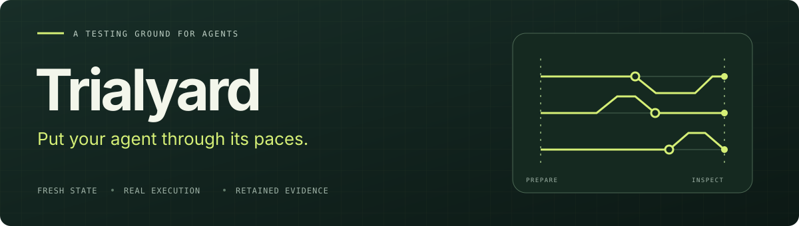

<p align="center">
  
</p>

<p align="center">
  <a href="https://github.com/luka-zivkovic/trialyard/actions/workflows/ci.yml"></a>
  
  
</p>

<p align="center">
  <a href="#quickstart">Quickstart</a> ·
  <a href="#connect-your-agent">Connect your agent</a> ·
  <a href="docs/README.md">Documentation</a> ·
  <a href="CONTRIBUTING.md">Contributing</a>
</p>

**Run real agents through repeatable scenarios in controlled environments, with evidence you can inspect.**

Trialyard prepares fresh state, runs your connected agent, and records its conversation, observable tool activity, and resulting environment state. Use it to reproduce a failure, exercise a recovery path, or inspect the effect of an agent change.

An agent saying “done” and a completed action are different observations. Trialyard preserves both, including what could not be observed. Behavioral assessment happens in a separate consumer.

## What you get

| Capability | What it gives you |
| --- | --- |
| **Controlled environments** | Stateful fixtures or adapter-owned disposable services, reset for every repetition. |
| **Repeatable scenarios** | Scripted turns, fixed repetitions, explicit inputs, and source identities. |
| **Failure exercises** | Declared tool faults, timeouts, cancellation, and cleanup diagnostics. |
| **Inspectable evidence** | Conversations, operation records, independent state snapshots, and explicit capture gaps. |
| **An iteration workflow** | Retained connections and source rebuilds that preserve the trial configuration and parent lineage. |
| **Portable handoffs** | Digest-verified bundles and explicit exports for external assessment. |

Repeatability covers the declared setup and procedure; model responses can still vary.

## Quickstart

The independent example runs locally with **no model key, account, database, or external agent repository**. It uses a scripted agent and a small inventory environment to demonstrate the full execution and evidence path.

Use Node **24.15.0** and npm **11.12.1** on macOS or Linux. With [nvm](https://github.com/nvm-sh/nvm) installed:

```sh
git clone https://github.com/luka-zivkovic/trialyard.git
cd trialyard
nvm install
nvm use
npm ci --ignore-scripts
npm run build
```

Create an example, execute it, and inspect the result:

```sh
mkdir -p .trial-runs
npm run trial -- init .trial-runs/example
npm run trial -- run .trial-runs/example/plan.json --request first --store .trial-runs/store
npm run trial -- show --request first --store .trial-runs/store --format text
```

The example runs **two turns × two fresh repetitions**. Each trial starts with three units and no reservations. The second turn observes the reservation made in the first. The text report shows the conversation, independent state, operation outcomes, evidence gaps, and cleanup.

`init` needs a new directory. An accepted request ID is never executed twice: reuse `first` to retrieve its recorded result, or choose a new ID for an intentional new execution. Keep the same `--store` when inspecting a run.

## Read the evidence

Every trial reports three independent dimensions:

| Dimension | The question it answers |
| --- | --- |
| **Execution** | Did the agent finish, fail, time out, or stop? |
| **Evidence** | Were the declared observations captured? What is missing? |
| **Cleanup** | Did the environment report successful disposal? |

**A run exiting `0` means execution finished with complete evidence and successful cleanup. It is not a quality verdict.** A fully captured run can show the agent confidently claiming a reservation that does not exist. Try that case in the [failure guide](docs/exercising-failures.md).

The run result prints a bundle directory and manifest digest for each trial. Use those values to verify or export it:

```sh
npm run trial -- verify <bundle-directory> --sha256 <printed-bundle-digest>
npm run trial -- export <bundle-directory> --format assessment-input --out <new-export.json>
```

Bundles retain the resolved plan, scenario, event journal, available state snapshots, and file inventory. Verification checks consistency and exact bytes; hashes do not authenticate the host. See [evidence and assessment](docs/evaluation-handoff.md).

## Connect your agent

The shortest supported path is a self-contained Node ESM function that declares `createAgent` / `runTurn` and explicitly selects the reference inventory tools. The [Node walkthrough](docs/assisted-setup.md) includes a copyable example and the exact contract.

```sh
npm run trial -- connect /absolute/agent-repo --out /absolute/new-connection
npm run trial -- run /absolute/new-connection/prepared/plan.json --request baseline --store /absolute/trial-store
npm run trial -- show --request baseline --store /absolute/trial-store --format text
```

Review the prepared scenario, fixture, limits, and capture profile before execution. `connect` reads public declarations and copies selected source; it does not install dependencies or infer your application's environment. Unsupported declarations produce a blocked draft with specific requirements.

After an intentional source edit, preserve the trial configuration in a new connection:

```sh
npm run trial -- rebuild /absolute/new-connection/connection.json \
  --source /absolute/agent-repo --out /absolute/candidate-2
```

Run the new prepared plan with a new request ID. The previous connection and evidence remain available. [Rebuild details →](docs/connection-rebuild.md)

For custom frameworks or services, use an explicit agent/environment adapter. The optional [setup skill](docs/connection-setup.md) guides source discovery, unresolved owner decisions, capability declarations, and bounded qualification.

### Set up with an assistant

An assistant with local file and terminal access can follow the bundled skill before your repository has any Trialyard configuration. Give it the two checkout paths:

> Read `<trialyard-checkout>/skills/connect-agent/SKILL.md` and follow it to initialize Trialyard for `<my-agent-repository>`. Connect the actual agent, preserve its first observed failures, and leave reusable run and inspection instructions.

The skill can help build the CLI, investigate your agent, and prepare the supported declaration or adapter. It keeps missing capabilities and owner decisions explicit. It does not add an automatic `init .` command or guarantee support for an arbitrary framework.

**Successful setup can reveal a failing agent.** The [qualification workflow](skills/connect-agent/references/qualification.md) separates integration checks from behavior, freezes cases and external expectations before qualification, and exercises relevant known-defect controls. A candidate's current response is never used as its own correct answer. These are assistant instructions; the CLI does not enforce case selection or assessment quality.

## Integrations and experiments

| Path | Current scope |
| --- | --- |
| [Node function](docs/assisted-setup.md) | Assisted setup and source rebuilds for a declared ESM function with the reference inventory. |
| [Pi / Webdesk](integrations/pi-webdesk/native-guide.md) | Real Pi loop and original tool callbacks, a local scripted provider, approvals, file/session evidence, and source iteration. Requires the pinned external checkout. |
| [Pi file cases](integrations/pi-webdesk/cases-guide.md) | Reuse a compiled connection across declared recovery paths. |
| [Pi assessment consumer](consumers/pi-assessment/README.md) | Separate assessment of a frozen approval criterion, with retained source identity and explicit missing evidence. |
| [Inspect AI](integrations/inspect-ai/README.md) | Experimental offline assessment of retained evidence; no candidate reruns. |
| [Scenario](integrations/scenario/README.md) | Experimental static conversation replay from verified trials. |

The core has no model-provider or evaluation-framework dependency. These integrations have individual prerequisites and limits; see the [support matrix](docs/current-preview.md).

## Status and boundaries

**Trialyard is a local developer preview.** It runs in your environment and stores captured content locally. Adapters are operator-trusted processes with the local user's filesystem and network permissions. Process separation controls lifecycle; it is not a hostile-code sandbox.

Hosted execution, universal framework support, model-driven user simulation, built-in business grading, and release decisions are outside the current scope. The v1 wire identifiers and `trial-runner.setup.json` filename retain their original names for compatibility. The CLI remains `trial`.

Read the [product charter](PRODUCT.md), [current support](docs/current-preview.md), and [credential/export boundaries](docs/privacy-and-exports.md) for the precise contracts.

## Development

```sh
npm run typecheck
npm test
npm run test:pi
npm --prefix consumers/pi-assessment ci --ignore-scripts
npm run test:assessment
npm run check:docs
```

The core and integration contract tests use synthetic fixtures. External runtime qualification has separate prerequisites and commands. [Contributor guide →](CONTRIBUTING.md)
