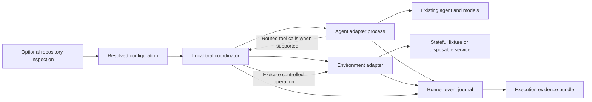

# Architecture and contracts

All requirements are **ASSUMPTION — specified v0.1 defaults**. Wire names are proposed contracts owned by the new project. They are not Coeval receipts or existing Dailies schemas.

**CURRENT:** the local implementation and qualified wire details are recorded in [current preview](current-preview.md), [model accounting](model-accounting.md), and [public acceptance plan](implementation-plan.md). Provider/customer integrations retain separate gates.

## Architecture

The core manages lifecycle and records evidence; the agent adapter retains the customer's actual orchestration, prompts and model calls. The environment adapter owns preparation, controlled tools, snapshots and cleanup for its declared resources. Framework, customer, tracing-provider and database-specific code stays in adapters/exporters.

Implementation default: TypeScript targeting Node 24, with exact runtime/dependency versions pinned at the first implementation milestone. Use one coordinator and one agent adapter process per trial; trials run sequentially. No queue, hosted API, distributed scheduler or production database for the runner itself is required.

## Vocabulary

- **Run:** one resolved agent target, ordered scenarios and a fixed repetition count.
- **Trial:** one execution of one scenario with fresh mutable state.
- **Turn:** one scripted user message and the resulting agent activity within a trial.
- **Operation record:** the accounting unit for one intended physical dispatch at a named boundary. It records intent, any observed dispatch and its terminal outcome; an intent alone is not proof that a request was sent.
- **Logical call:** an application-level request that can cause several physical operations. Retries get new operation IDs, share a logical call ID and may carry an attempt index; attempts are not a second independently counted entity.
- **Outcome:** observed resulting environment state, distinct from the assistant's claim.
- **Evidence profile:** the observations required at a declared capture boundary.
- **Fidelity declaration:** real, substituted and uncontrolled components, with coverage and limits.
- **Complete:** all observations required by that evidence profile are present and valid; it does not mean passing.

## Configuration objects

Configuration is UTF-8 JSON, with closed, versioned top-level and contract objects. Unknown fields and unsupported versions are errors. JSON values in explicitly named adapter `settings` fields are open only under the adapter's pinned settings schema. Duplicate JSON keys, nonfinite numbers, duplicate IDs and ambiguous paths are rejected. All configuration references, including references inside scenario files, are resolved relative to the plan directory. Artifact inventory paths are relative to their declared bundle root. Neither may traverse outside its root or follow undeclared symlinks.

| Object | Required meaning |
| --- | --- |
| Run plan `trial-runner/plan/v1` | One agent descriptor, one environment descriptor, ordered scenario references, fixed repetitions, finite limits, evidence profile, capture policy and explicit secret bindings |
| Agent descriptor | Adapter ID/version, executable argv array, relative working directory, adapter/source artifact manifest, declared capture capabilities and adapter settings |
| Environment descriptor | Adapter ID/version, initial fixture reference, fixture schema, controlled-resource definitions, tool/schema references, clock strategy, fault plan, reset/snapshot/cleanup capabilities and settings |
| Scenario `trial-runner/scenario/v1` | Stable ID, description, ordered nonempty scripted messages, optional explicit fixture override, scenario provenance and optional external criterion/reference IDs |
| Evidence profile | Required conversation, tool boundary, final state, model-event/usage coverage, version identities and conditional terminal observations |
| Secret binding | A variable name from the operator environment and its allowed recipient; never the value or a digest of the value |

Source manifests enumerate the actual local artifact files and dependency lockfiles supplied for execution. A Git SHA alone is not enough when the launched artifact differs or includes local changes. Uncaptured dependencies are listed as identity gaps. External criteria or reference labels are not supplied to the agent; scenarios contain user behavior, not answer keys.

For each trial, use `scenario.fixture` when present; otherwise use `environment.initialState`. This is an explicit replacement, never a merge. Validate the selected data against the environment's pinned fixture schema. Resolve and bind exactly one fixture digest for every trial slot before acceptance. All repetitions of that scenario use that resolved fixture. A changed file after acceptance is an identity error, not a new implicit fixture.

`repetitions` is an integer from 1–100, default 1. Trial slots are allocated before execution in scenario order, then repetition order. Every slot receives a stable index and terminal or `not_started` record, so stopped runs cannot hide requested coverage. This product does not choose baseline/candidate pairs or calculate release comparisons.

## Agent adapter contract

The reference transport is NDJSON over a child process's stdin/stdout. Each frame is one UTF-8 JSON object followed by LF. Stdout is reserved for the protocol; bounded stderr is diagnostic data. A frame envelope contains `protocol`, `kind`, `trialId`, `messageId` and `payload`; replies add `replyTo`. Unknown kinds, repeated IDs, invalid correlations or frames after terminalization cause a protocol error. The runner assigns received event sequence numbers.

| Direction | Frame | Contract |
| --- | --- | --- |
| Runner → agent | `start` | Trial identity, pinned public configuration, declared tool bindings and remaining limits. Secret values are passed only through the selected child environment. |
| Agent → runner | `ready` | Effective capabilities, observed candidate identity and discrepancies from requested identity. The runner must verify them before releasing any user turn or business dispatch; adapter startup must make no model or business-tool call. |
| Runner → agent | `user_turn` | Turn ID and scripted input; only one turn is outstanding. |
| Agent → runner | `event` | Typed observed model/tool/application activity with operation identity, source and parent correlation. |
| Runner → agent | `event_ack` | Acknowledges that a dispatch-intent event has been durably journaled; required before a participating adapter sends the physical request. |
| Agent → runner | `tool_call` | A new call ID, an exposed tool name and schema-valid arguments. Used only when the adapter routes that tool through the runner. |
| Runner → agent | `tool_result` | The matching call ID and exactly one result: value, declared simulated error, or unknown outcome. |
| Agent → runner | `turn_finished` | Completed assistant output, turn ID and outstanding-operation declaration. A turn cannot silently close an open routed tool call. |
| Agent → runner | `agent_error` | Observed candidate failure, not an infrastructure label guessed from response text. |
| Runner → agent | `stop` | Normal completion or cancellation/deadline reason. |
| Agent → runner | `stopped` | Local stop acknowledgment and known outstanding work; does not prove remote providers stopped. |

No chain-of-thought capture is required or requested. Model events record available request/response metadata, exposed outputs, model settings and actual attempts at the configured boundary. The adapter must not claim observation of hidden SDK retries or internal provider work it cannot see. A profile requiring those observations is unsupported until the adapter can supply them.

Each accounting boundary has one owner. For runner-routed tools, the runner allocates the operation ID and other observations correlate to it; an adapter must not count the same dispatch again under a new ID. For adapter-owned model calls, the adapter allocates the ID and sends `operation.dispatch_intent`, then awaits `event_ack` before dispatch. The environment worker uses the same durable acknowledgment rule for its controlled external requests. The recorder rejects duplicate accounting records, retains distinct observational events under the existing ID, and separates nested boundaries by kind and parent ID rather than summing them as duplicate tool/model calls.

After the actual call boundary is observed, record `operation.dispatch_observed`; then record a known result, known failure or unknown outcome. A crash between the acknowledged intent and the physical send leaves dispatch unknown unless independent evidence establishes it. Reports distinguish dispatch intents, observed dispatches and unknown dispatches. Do not label every acknowledged intent an actual provider request. An adapter unable to participate in this protocol declares uncertain capture/counts and cannot satisfy a profile requiring exact accounting at that boundary.

Agent adapters may translate this protocol to HTTP, SSE or an in-process framework, but must not change the candidate's business logic. If tool substitution or observation requires an application test hook, document and version that hook with the integration.

## Environment adapter contract

Environment adapters implement `describe`, `prepare`, `execute`, `snapshot` and `dispose`, each with a deadline/cancellation context and operation ID. They execute in a separate worker from the coordinator. The SDK must expose versioned request/result schemas even when the initial implementation uses an in-process language interface inside that worker.

- `describe` reports settings/tool schemas, supported fault modes, snapshot coverage, clocks and resource-isolation capabilities without modifying resources.
- `prepare` creates a new trial lease, seeds fresh state and returns a verified initial snapshot, resource IDs and agent bindings. There is no reusable mutable lease in v0.1.
- `execute` accepts only declared tools with schema-valid arguments. It obtains durable acknowledgment of dispatch intent before side effects, records observed dispatch where available, and returns a value, a specified failure, or `outcome_unknown` if the operation may have happened but its result cannot be established. No fabricated success and no fallback to a live service.
- `snapshot` reads the environment through its declared observer, independent of the agent's prose. It reports state plus coverage, observation time, unresolved writes and whether the view was quiescent. Pending remote writes make required final state incomplete unless the profile explicitly supports that terminal condition.
- `dispose` removes only resources owned by the lease and verifies cleanup. Repeated disposal must be safe. It must never reset a shared or production database merely because a connection string exists.

State persists across turns within the lease and is never carried into another trial. Fixtures specify clock behavior: frozen/controlled where supported, otherwise observed real time with an explicit fidelity limitation. Data, IDs, fault schedules and random seeds are pinned independently of model randomness. A seed is not claimed to control an unsupported model provider.

Record/replay is optional adapter behavior. A fixture must match the normalized operation contract and declared state transition, not return the next recorded response for any request. Unmatched operations terminate with an unsupported-capability diagnostic. A declared simulated service error is valid trial behavior and can be fully captured; an unsupported simulation is an environment gap.

## Lifecycle and execution limits

`validate → accepted → preparing → running turns → stopping → collecting state → disposing → finalizing`.

Offline validation does not execute repository or adapter code; it checks pinned declarations. After acceptance, the runner durably allocates every trial slot. For each slot it starts the environment worker, verifies `describe`, prepares the fresh lease and validates the initial snapshot. Only then does it start the agent worker, send `start` with those bindings, and verify `ready` against the required profile and observed identities. Candidate business work is forbidden during this handshake. If preparation/reset fails, the agent worker is never launched. If the agent handshake fails, no user turn, model call or business-tool dispatch is released. After cancellation or timeout, stop new turns/operations, request cooperative stop, terminate the local process group after its grace period, collect available state and perform bounded cleanup.

Defaults, chosen as engineering limits rather than measured performance claims:

| Limit | Default |
| --- | --- |
| Prepare deadline | 60 seconds per trial |
| Agent ready + all turns | 120 seconds per trial |
| Stop grace | 5 seconds |
| Final snapshot | 15 seconds |
| Cleanup | 15 seconds |
| Turns | At most 20 scripted turns per scenario |
| Frame size / event count | 1 MiB / 10,000 per trial |
| Total recorded payload | 64 MiB per trial, including diagnostic logs |

The preparation deadline includes environment-worker startup, `describe` and `prepare`. The trial deadline includes agent-worker startup, `ready` and all turns. Snapshot and disposal have the separate finite deadlines above. No adapter startup phase has an unbounded wait.

All limits can be set explicitly within implementation-published finite bounds. An external caller's absolute deadline is a ceiling; no nested adapter can extend it. Cleanup may run for its explicitly declared separate grace period after caller waiting has ended, recorded as such. Event/byte limits stop capture and execution with an explicit gap; they never silently truncate required evidence into “complete.”

Monetary/token caps are supported only when all relevant calls can be intercepted and a conservative per-call reservation is enforceable. The first generic adapter promises deadline, turn, frame, event-count and recorded-byte bounds, not CPU, memory, network or hard dollar caps. A plan requiring an unsupported hard budget or resource limit is rejected. Available usage and cost estimates carry units, source and pricing identity; missing usage is unknown, not zero. Model-driven setup is outside the run budget and is absent from the default v0.1 path.

## Repetition, idempotency and interruption

Fixed repetitions create new trial identities and fresh leases. They are not retries, and results are not filtered to the best trial. The core does not automatically retry a started agent trial or a non-idempotent operation. Intentional agent retries and adapter-declared provider attempts remain separately recorded.

`requestId` is scoped to one configured local output store. An atomic accepted-request record binds it to exact resolved-plan/input digests. A matching duplicate returns existing status/artifact; a different digest conflicts. An active lock prevents a second executor. After a crash, `trial show` exposes interruption and uncertain operations; reusing the request ID must not replay them. A new execution requires a new request ID and carries a `rerunOf` reference. There is no in-place agent-session resume in v0.1.

After a process crash, preserve the journal as an unfinished artifact. Recovery may append a terminal recovery record, missing-observation list and cleanup results without altering prior events. It never completes missing agent actions. Safe, ownership-verified cleanup can be retried independently. No protocol claims exactly-once remote side effects without an actual service idempotency contract.

## Terminal states and completeness

Execution state is one of `not_started`, `finished`, `agent_error`, `timed_out`, `cancelled`, `environment_error`, `adapter_error`, `protocol_error`, or `runner_error`. A separate reason describes the boundary and outstanding work. `outcome_unknown` is an operation outcome, not an invented task failure.

Evidence state is `complete` or `incomplete`, with an explicit missing/invalid observation list. Before dispatch the evidence profile freezes its required observations and conditional terminal rules; a trial cannot weaken that profile after a fault.

| Situation | Execution | Evidence |
| --- | --- | --- |
| Agent finishes; all required events and state observed | `finished` | `complete`; business outcome may still fail |
| Agent finishes; required final state missing | `finished` | `incomplete` |
| Agent demonstrably crashes; error, event closure and final state captured | `agent_error` | May be complete under the frozen failure profile |
| Timeout/cancellation; all required terminal observations captured | `timed_out` / `cancelled` | May be complete as evidence of that outcome; not successful task execution |
| Outstanding remote operation could change final state | Actual terminal state | Incomplete when a stable final state is required |
| Reset/preparation fails or a planned slot is never dispatched | `not_started` | Incomplete task evidence |
| Capture/protocol failure or required payload exceeds limits | Relevant infrastructure state | Incomplete |

Cleanup has its own `succeeded`, `failed` or `unknown` result. A known cleanup failure need not invalidate already captured state, but makes the run operationally unsuccessful and prevents further trials. Remaining allocated slots are reported as not started. A fully captured agent error can permit later fresh trials only after successful cleanup and with budget/deadline remaining.

CLI exits: `0` when every requested trial finished with complete evidence and successful cleanup; `1` for invalid configuration before acceptance; `2` for accepted runs with execution failure, missing evidence, incomplete coverage or cleanup failure; `130` for user cancellation. Exit `0` never means a behavioral assessment passed or a release should ship.

## Evidence bundle and identity

Each finalized trial bundle contains `manifest.json`, `plan.json`, `scenario.json`, `events.ndjson`, `initial-state.json`, `final-state.json` when available, and referenced bounded payload files. Missing artifacts remain declared with reasons rather than replaced by empty objects. A run index identifies every planned trial, terminal state, artifact digest and coverage.

The closed manifest records:

- Schema version, run/request/trial IDs, scenario/repetition index and optional caller correlation.
- Requested and observed agent/build, adapter, fixture, scenario and runner identities, with unavailable values explicit.
- Requested model bindings/settings and observed provider model/request identifiers when supplied.
- Evidence profile and fidelity declaration, execution/cleanup states, operation outcomes and missing observations.
- Required/observed coverage and available latency, usage and cost with their provenance.
- A sorted file inventory of safe relative paths, byte lengths and SHA-256 digests; no external path or symlink is accepted.

The manifest itself is excluded from its file inventory. The bundle ID is the SHA-256 digest of the exact UTF-8 manifest bytes, supplied by its enclosing run index or caller. Files and event order are verified from that manifest. JSON whitespace changes alter exact-byte identity; consumers must not reserialize before verification. A digest in the same untrusted directory establishes internal integrity, not independent authenticity. Native artifacts are finalized atomically and not overwritten; a correction or redacted export creates a new artifact with an explicit parent digest.

Events include a runner-assigned sequence, recorded timestamp, producer/source, trial/turn/operation IDs, optional logical call ID and attempt index, event kind, parent correlation, and payload or payload reference. Receive order is authoritative for the journal; it is not claimed to be a total physical ordering of concurrent remote events. Producer timestamps are retained separately. Every dispatch intent closes with a known non-dispatch, result, failure or explicit unknown outcome. Counts distinguish intent from observed dispatch and uncertainty.

Provenance distinguishes `runner_observed`, `adapter_reported`, `environment_observed` and `candidate_claim`. Environment observation means outside the candidate response, not an independent trusted authority. Content hashes do not certify a simulator, a compromised adapter, an application build or the host. Completeness is always scoped to the declared capture boundary.

## Local trust and data handling

This version runs operator-trusted code in customer-owned infrastructure. Separate processes, fresh directories and environment allowlists provide lifecycle control; they do not constrain hostile code's filesystem/network access. A required hostile-code sandbox or enforceable network containment is unsupported unless the operator provides a separately verified execution environment. The product must not advertise local process mode as a security sandbox.

Do not inherit the full parent environment. Secret bindings are explicit per recipient. The runner must never serialize supplied secret values into configuration or command arguments. Mask known bound-secret values before writing any capture surface: protocol/event payloads, conversation, tool results, state snapshots and diagnostic logs. Redaction metadata records which required fields were removed. This mechanism does not guarantee detection of arbitrary unbound, transformed or encoded secrets or all personal data; the product must not claim general data-loss prevention. Raw trial content stays local by default; external export is an explicit command. Trace imports and repository uploads are never automatic. Redaction that removes required evidence changes completeness for that profile.

Local stores use restrictive file permissions and document disk/CI access requirements. Retention is operator-managed in v0.1. Recovery metadata may identify resources for cleanup, but must not contain reusable credentials.

## Contract implementation gate

Before runtime code depends on these contracts, implement closed JSON Schemas using [JSON Schema 2020-12](https://json-schema.org/draft/2020-12), semantic validators and positive/negative interoperability fixtures. The examples are illustrative; schemas and tests must enforce ordering, identity, coverage and state semantics that JSON shape alone cannot establish. Freeze a wire version only after this conformance gate. Changing meaning after freeze requires a new version; it never silently reinterprets retained evidence.

## M2 implementation binding

**CURRENT:** [Assisted setup](assisted-setup.md) binds the target discovery/preparation flow to `node-function/v1` and explicit `reference-inventory/v1`. The experimental closed contracts are `$defs.setup`, `discovery`, `setupDraft`, `setupProvenance` and `preparation` in `contracts/v1.schema.json`. `src/discovery` reads only public declarations during inspection and explicit allowlisted source during preparation. The process wrapper preserves candidate source and connects its documented function hook to the existing M1 protocol. Missing declarations yield a blocked draft, not a replacement agent or inferred environment. Runtime qualification and limitations are recorded separately in [current support](current-preview.md).
